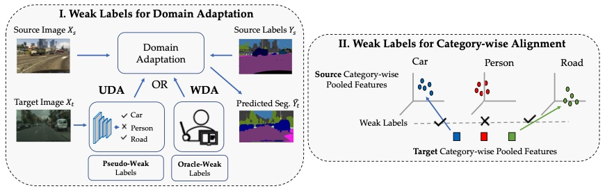
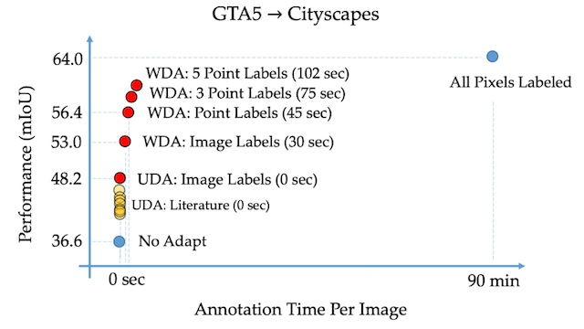

# Domain Adaptive Semantic Segmentation Using Weak Labels

> **Domain Adaptive Semantic Segmentation Using Weak Labels**
> Sujoy Paul, Yi-Hsuan Tsai, Samuel Schulter, Amit K. Roy-Chowdhury, Manmohan Chandraker
> ECCV 2020
> [arXiv](https://arxiv.org/abs/2007.15176), [project](https://www.nec-labs.com/~mas/WeakSegDA/)

<p align="center"></p>


## Highlights

* Improve domain adaptive semantic segmentation with weak labels
* Weak labels can be pseudo labels (unsupervised domain adaptation) or human-annotated (weakly-supervised domain adaptation)
* Weak labels can be image-level tags or point annotations
* 56.4% mIoU on GTA->CityScapes when using point annotations (45 seconds annotation time per image)

<p align="center"></p>


## Installation

See [docs/INSTALL.md](docs/INSTALL.md) for installation instructions.


## Getting started

Evaluate a pre-trained model on the [CityScapes](https://www.cityscapes-dataset.com/) dataset.

* Download CityScapes and put into `datasets/cityscapes` (the folder `leftImg8bit` should be at `datasets/cityscapes/leftImg8bit`)
* Download the `pseudoweak-cw-pa` pre-trained model from [here](https://drive.google.com/file/d/1mmZWyff3OKmY0V0C83kO1nnkgsm6vfZc/view?usp=sharing), and store it in the directory `models`.
* Run the Python command below
* Segmentation outputs are saved with the colorized format via a pre-defined color palette in `daweak/engine/trainer_base.py` (for 19 categories as in Cityscapes)
* To evaluate other pre-trained models, you can pick a different model path (`--restore-from`). To see if other models use different hyper-parameters, check the shell scripts in the directory `scripts`.

``` shell
python eval.py \
    --model deeplab \
    --dataset-target cityscapes \
    --data-path-target datasets/cityscapes \
    --input-size-source "1280,720" \
    --input-size-target "1024,512" \
    --num-classes 19 \
    --test-split val \
    --restore-from models/gta5-cityscapes-pseudoweak-cw-pa.pth \
    --result-dir result/gta5-cityscapes-weak-cw-pa \
    --use-weak \
    --use-weak-cw \
    --use-pseudo \
    --use-pixeladapt
```


## Model zoo

Definitions of the prefix in each model name:

* **pseudoweak**: use weak label loss with pseudo-weak labels, `--use-pseudo` and `--use-weak`
* **cw**: use category-wise alignment, `--use-weak-cw`
* **pa**: use pixel-level alignment, `--use-pixeladapt`
* **weak-image**: use weak label loss with ground truth image-level weak labels, `--use-pseudo` is false and `--use-weak`
* **weak-1point**: use weak label loss with ground truth point-level weak labels, `--use-pointloss` and `--use-weak`


### Source: GTA5

| Name             | mIoU  | Paper                               | Download                                                                                   |
|------------------|-------|-------------------------------------|--------------------------------------------------------------------------------------------|
| pseudoweak-cw-pa | 48.02 | Table 1 - "Ours (UDA)" (*)          | [link](https://drive.google.com/file/d/1mmZWyff3OKmY0V0C83kO1nnkgsm6vfZc/view?usp=sharing) |
| weak-image-cw-pa | 53.02 | Table 1 - "Ours (WDA: Image)"       | [link](https://drive.google.com/file/d/1mn6Q6yx8FT1ZCEzdZH1f7MeulV3VWWGR/view?usp=sharing) |
| weak-1point      | 56.42 | Table 1 - "Ours (WDA: Point)"       | [link](https://drive.google.com/file/d/1mbuXnjNL_tOZW_ZAELUMuGNPV76Oyp_e/view?usp=sharing) |
| pseudoweak       | 44.2  | Table 3 - Pseudo-Weak +L_c          | [link](https://drive.google.com/file/d/1meqOWkHLPtVKLUX6W1evyzv0ghYTVFFd/view?usp=sharing) |
| pseudoweak-cw    | 45.55 | Table 3 - Pseudo-Weak +L_c +L^C_adv | [link](https://drive.google.com/file/d/1moOwe7QxrQ7-WqKshPiu58KWIDkwEaMR/view?usp=sharing) |

* NOTE: Paper reports 48.20!


### Source: Synthia

| Name             | mIoU* | mIoU  | Paper                                | Download                                                                                   |
|------------------|-------|-------|--------------------------------------|--------------------------------------------------------------------------------------------|
| pseudoweak-cw-pa | 44.27 | 51.9  | Table 2 - "Ours (UDA)"               | [link](https://drive.google.com/file/d/1mt4ZZ0Dv8Fd0Nok9TZ5SlJ5bJWitf2q7/view?usp=sharing) |
| weak-image-cw-pa | 50.6  | 58.51 | Table 2 - "Ours (WDA: Image)"        | [link](https://drive.google.com/file/d/1muapekNtpoaaYX1aCKyO0Ftr3cCbNhiJ/view?usp=sharing) |
| pseudoweak       | 41.74 | 49.08 | Table 4 - Pseudo-Weak +L_c           | [link](https://drive.google.com/file/d/1mm-ArWJ-oXKmSUB_JFbIsSzDSkx0SmvX/view?usp=sharing) |
| pseudoweak-cw    | 42.65 | 49.91 | Table 4 - Pseudo-Weak +L_c + L^C_adv | [link](https://drive.google.com/file/d/1mmkkvmB_Yhy2NKsi-PKrEOY8N5ZbB500/view?usp=sharing) |


## Code structure

* Definitions of experimental options, settings, and parameters are in `daweak/util/option.py`
* Dataset loaders and model definitions are in the `daweak` library folder
* Main executing files are in the root folder (see below for testing and training details)
* Main script for training/testing is `run_weak_da.sh`

See [docs/TRAINING.md](docs/TRAINING.md) for more details on training a new model.


## License

The code is released under the [MIT License](LICENSE).


## Citation

    @inproceedings{paul2020daweak,
      title={Domain Adaptive Semantic Segmentation Using Weak Labels},
      author={Sujoy Paul and Yi-Hsuan Tsai and Samuel Schulter and Amit K. Roy-Chowdhury and Manmohan Chandraker}
      booktitle={ECCV},
      year={2020}
    }
